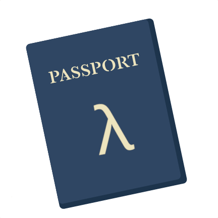

# Passport

The Passport automated Coq proof script synthesis tool

The following are the directions for installation and use of Passport.

## 1. Installation

Passport operates within the [CoqGym](https://github.com/princeton-vl/CoqGym) learning environment and so modifies their code. 

### Dependencies
* [OPAM](https://opam.ocaml.org/)
* [Anaconda Python 3](https://www.anaconda.com/distribution/)
* [LMDB](https://symas.com/lmdb/)
* [Ruby](https://www.ruby-lang.org/en/)

### Building Coq, SerAPI, CoqHammer, and the CoqGym Coq Projects

1. Create an OPAM switch for OCaml 4.07.1+flambda: `opam switch create 4.07.1+flambda && eval $(opam env)`
2. Upgrade the installed OPAM packages (optional): `opam upgrade && eval $(opam env)`
3. Clone the repository: `git clone https://github.com/LASER-UMASS/Passport.git`
4. Install Coq, SerAPI and CoqHammer: `cd Passport && source install.sh`
5. Build the Coq projects (can take a while): `cd coq_projects && make && cd ..`
6. Create and activate the conda environment: `conda env create -f passport.yml && conda activate passport`

The `source install.sh` command will modify your terminals
environmental variables for working with Passport, as well as building
and installing dependencies. If you open a new terminal after the
building and installing is done, run `source swarm/prelude.sh` to
initialize your terminal environment.

## 2. Extracting proofs from Coq projects

For any Coq project that compiles in Coq 8.9.1 that you want to use (and may not be in the CoqGym dataset), the following are the steps to extract the proofs from code:

1. Copy the project into the  `coq_projects` directory. 
2. For each `*.meta` file in the project, run `python check_proofs.py --file /path/to/*.meta`   
This generates a `*.json` file in `./data/` corresponding to each `*.meta` file. The `proofs` field of the JSON object is a list containing the proof names.
3. For each `*.meta` file and each proof, run:  
`python extract_proof.py --file /path/to/*.meta --proof $PROOF_NAME`  
`python extract_synthetic_proofs.py --file /path/to/*.meta --proof $PROOF_NAME`
4. Finally, run `python postprocess.py`

## 3. Using the CoqGym benchmark dataset

### Download the CoqGym dataset

1. Download the CoqGym dataset (you do not need to extract proofs from Coq projects)
[here](https://drive.google.com/drive/folders/149m_17VkYYkl0kdSB4AI8zodCuTmPaA6?usp=sharing)
2. Unzip the data and set the paths: `python unzip_data.py`

### Training Examples (proof steps)

1. Proofs steps used in the paper are found in `processed.tar.gz`, which can be downloaded from the replication package link provided above. This should be copied into `Passport/`
2. To extract new proofs, run `python extract_proof_steps.py`.

## 4. Training Passport

To train, for example, the Tok model on all the proof steps, run 
`python main.py --no_validation --exp_id tok --no-locals-file --training`

Model checkpoints will be saved in `Passport/runs/tok/checkpoints/`. See `options.py` for command line options.

## 5. Evaluation

Now, you can evaluate a model you trained on the test set. For example, the Tok model that you trained can be run with `python evaluate.py ours tok-results --path /path/to/tok_model/*.pth --no-locals-file`.
If you used additional options in training, specify those same options for evaluating.
